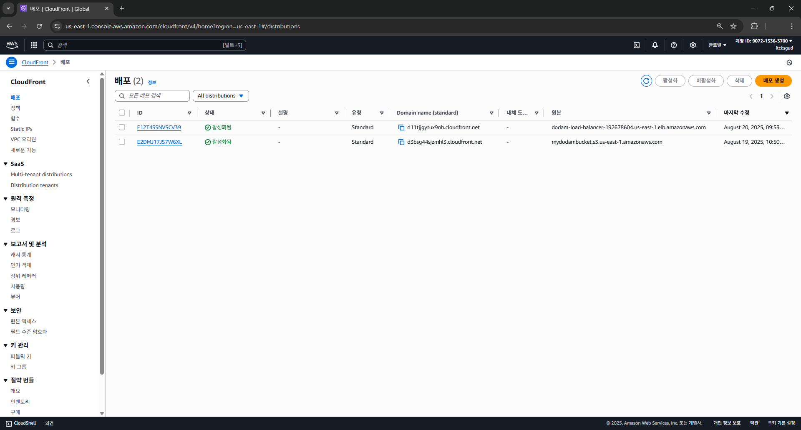
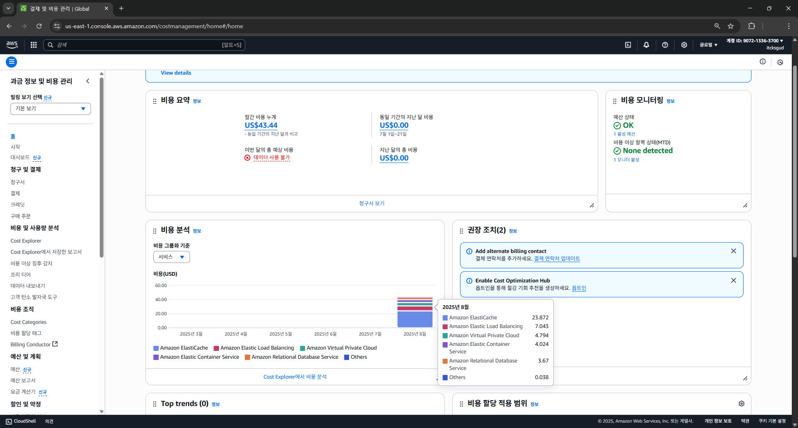

# 2025_dodam

***

# 🚀 Full-Stack AWS 배포 프로젝트

이 프로젝트는 Docker 컨테이너 기반의 백엔드와 Vite로 빌드된 프론트엔드를 AWS 환경에 배포하고, GitHub Actions를 통해 CI/CD 파이프라인을 자동화하는 전체 과정을 보여줍니다.

---

## 🏗️ 아키텍처

사용자의 요청부터 애플리케이션까지의 흐름은 다음과 같습니다.

1.  **Frontend**:
    * `사용자` → `CloudFront (Frontend)` → `S3 Bucket`
    * 정적 웹사이트 호스팅을 위해 S3를 사용하며, 전 세계 사용자에게 빠른 콘텐츠 전송을 위해 CloudFront를 캐시 서버로 사용합니다.

2.  **Backend**:
    * `사용자` → `CloudFront (Backend)` → `Application Load Balancer` → `ECS Fargate (Container)`
    * API 요청은 별도의 CloudFront Distribution을 통해 ALB(Application Load Balancer)로 전달됩니다.
    * ALB는 들어온 요청을 ECS Fargate에서 실행 중인 Docker 컨테이너로 분산합니다. ECS Fargate는 서버리스 컨테이너 실행 환경으로, 서버 관리가 필요 없습니다.

3.  **CI/CD**:
    * `로컬에서 'main' 브랜치로 Push` → `GitHub Actions 트리거` → `AWS 리소스로 자동 배포`
    * 백엔드와 프론트엔드 배포가 하나의 워크플로우에서 자동으로 실행됩니다.

---

## 🛠️ 기술 스택

* **Frontend**: Vite, S3, CloudFront
* **Backend**: Docker, Amazon ECR, Amazon ECS (Fargate), Application Load Balancer, CloudFront
* **Database**: MariaDB
* **Cache**: Amazon ElastiCache (Redis)
* **CI/CD**: GitHub Actions

---

## 🔄 CI/CD 파이프라인

`.github/workflows/deploy.yml` 워크플로우는 `main` 브랜치에 코드가 푸시될 때마다 자동으로 실행되며, 다음 단계를 수행합니다.

1.  **AWS 자격 증명**: GitHub Actions 워크플로우가 AWS 리소스에 접근할 수 있도록 인증합니다.

2.  **Backend 배포 (ECS)**:
    * 백엔드 애플리케이션을 Docker 이미지로 빌드합니다.
    * 빌드된 이미지를 Amazon ECR(Elastic Container Registry)에 푸시합니다.
    * 새로운 이미지 태그로 ECS Task Definition을 업데이트합니다.
    * 업데이트된 Task Definition을 ECS Service에 반영하여 새로운 컨테이너를 배포합니다.

3.  **Frontend 배포 (S3 & CloudFront)**:
    * Vite 프로젝트를 빌드하여 정적 파일(`dist/` 폴더)을 생성합니다.
    * 빌드된 결과물을 `aws s3 sync` 명령어를 통해 S3 버킷에 동기화합니다.
    * 사용자가 즉시 새로운 버전을 볼 수 있도록 `aws cloudfront create-invalidation` 명령어로 CloudFront 캐시를 무효화합니다.

---

## 💡 비용 분석 및 개선 사항

프로젝트 배포 후 트래픽이 거의 없음에도 불구하고 **월 약 $43의 비용이 발생**했습니다.

### 💰 비용 발생 핵심 원인

비용의 대부분은 실제 사용량과 관계없이 **리소스를 실행하는 것만으로도 시간당 비용이 청구되는 서비스**들 때문에 발생했습니다.

1.  **Amazon ElastiCache (약 $24)**: 가장 큰 비용을 차지한 Redis 클러스터입니다. 
2.  **Application Load Balancer (약 $7)**: ALB는 시간당 고정 비용이 발생합니다. (월 약 $18~$20)
